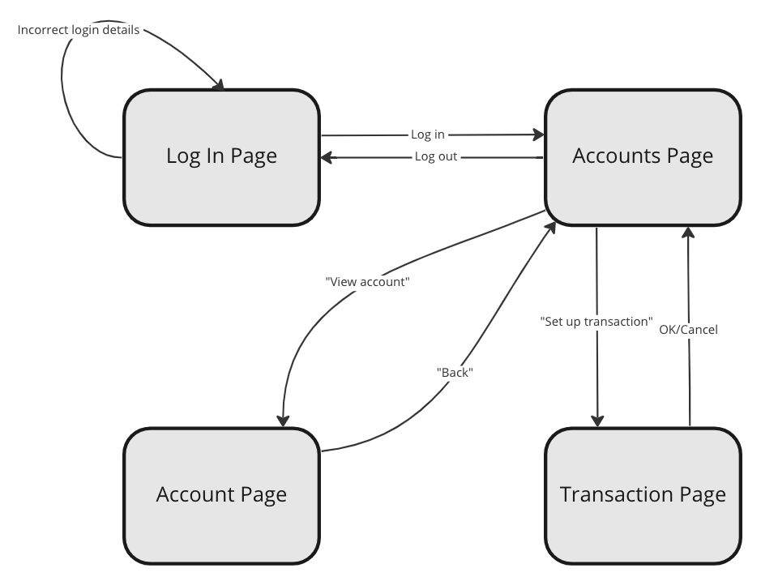

# State Transition Testing

A product (application, site, etc.) may have a number of different **states** it
can be in - for example, logged in or not logged in, and different pages on the
website being shown. It's possible to **transition** between some states and
others, resulting from **events** and the transition may cause other
**actions**.

If we consider our very basic website (which so far has no other purpose other
than allowing users to sign-up, log in and log out!) we might consider the
states as being different pages. We already know of two - sign-up and login -
and perhaps you could think of there being others, especially some sort of
"signed in" page.

There are also events, like "logging in" or "logging out", but they will only
apply under certain conditions - or apply to certain states - and those will
have transitions to other states. For example, "logging out" as an event
wouldn't be possible from everywhere, certainly not on the login page.

Actions can be transitions between states, but they can also be other effects
resulting from an event. While a "signing up" action might take a user to the
login page, it could instead leave the user on the sign up page (perhaps for
signing up >1 accounts) but have the effect of adding that user's details to a
database.

## Example

It's common for state transition diagrams to only show the valid transitions
between states, but it's possible to include invalid ones as well. By invalid,
we mean transitions that *shouldn't be possible* rather than something like
putting in an invalid password!

In this example and going forwards, we'll only be dealing with the valid
transitions.

Let's look at a state transition diagram for Makers Bank, which may look
familiar:

When designing tests using a state transition diagram, they can be chosen to do
things like:

* Covering all states
* Covering all transitions
* Covering sequences of states and the transitions between them
* etc. (including invalid transitions)

For Makers Bank, from its state transition diagram (whether we agree with it or
like it, it doesn't matter) there are four states:

* Log In Page
* Accounts Page
* Account Page
* Transaction

We also have 8 different events and transitions - the arrows on the diagram,
noting that one has two valid events attached to it.

From this, we can produce a **state transition table**, which can be used to
plan testing e.g. covering all states at least once, all transitions, a single
path through the application.

| Initial State | Event | Next State | 
|-|-|-|
| Log In Page | Incorrect login details | Log In Page |
| Log In Page | Log in | Accounts Page |
| Accounts Page | Log out | Log In Page |
| Accounts Page | View account | Account Page |
| Accounts Page | Set up transaction | Transaction Page |
| Account Page | Back | Accounts Page |
| Transaction Page | OK | Accounts Page |
| Transaction Page | Cancel | Accounts Page |

A test which ensured we covered all states at least once might look as follows:

* Start: Log In Page
* Log in => Accounts Page
* View account => Account Page
* Back => Accounts Page
* Set up transaction => Transaction Page

## Challenge

This is a process feedback challenge. For this challenge, you won't be
submitting a video but instead you'll be providing a link to GitHub where you've
put resources you've created.

Work through the following steps to produce a state transition diagram for our
basic website, with its sign-up/log in/etc. functionality, then use that diagram
to think about planning some hypothetical tests.

1. Write down the different **states** e.g. sign-up page
2. Write down the different **events** e.g. user logs in
3. Determine which events cause a transition between one state and another
4. Make this into a state transition diagram
5. Draw up a state transition table, based on your diagram, populating the table
   below
6. Design a test case that covers all states and all events/transitions at least
   once i.e. what is the starting state and what events (in what order) are
   required
7. Commit your resources (state transition diagram and test case) to GitHub and
   submit your challenge

| Initial State | Event | Next State | 
|-|-|-|
| ... | ... | ... |

N.B. You don't need to represent the whole of the rest of this website, whatever
it does. Focus on the current functionality around signing up and logging in,
and have a single page for "user is logged into the site". This is not unusual -
perhaps you're planning to test the sign-up and login functionality
specifically, and so the rest of the site is not in scope right now.

[After you're done, submit your challenge with a link to your GitHub
repository](https://airtable.com/shrNFgNkPWr3d63Db?prefill_Item=et_as01).

## Usage & Alternatives

While we've continued with the sign-up/log in/etc. example in this page, state
diagrams are more often used for lower level components and program state than
websites. Websites can sometimes have links to most or all other pages making a
state diagram and state transition table overly complex and with little value.

We could also have thought about different states for our example, such as
whether a user's account details are yet signed up or not and whether they are
logged in or not (i.e. expecting just three valid states, not four!), then the
transitions between those (i.e. no way to transition back from signed up
state(s) to any not-signed up state(s)). Maybe you already did that in your
exercise above!

Optionally, take a few moments to sketch out an alternative representation of
our application's states in a new state transition diagram. Don't worry about
creating the associated state transition table as well, though!

<!-- BEGIN GENERATED SECTION DO NOT EDIT -->

---

**How was this resource?**  
[😫](https://airtable.com/shrUJ3t7KLMqVRFKR?prefill_Repository=makersacademy%2Fextending-testing&prefill_File=phase1%2F05_state_transitions.md&prefill_Sentiment=😫) [😕](https://airtable.com/shrUJ3t7KLMqVRFKR?prefill_Repository=makersacademy%2Fextending-testing&prefill_File=phase1%2F05_state_transitions.md&prefill_Sentiment=😕) [😐](https://airtable.com/shrUJ3t7KLMqVRFKR?prefill_Repository=makersacademy%2Fextending-testing&prefill_File=phase1%2F05_state_transitions.md&prefill_Sentiment=😐) [🙂](https://airtable.com/shrUJ3t7KLMqVRFKR?prefill_Repository=makersacademy%2Fextending-testing&prefill_File=phase1%2F05_state_transitions.md&prefill_Sentiment=🙂) [😀](https://airtable.com/shrUJ3t7KLMqVRFKR?prefill_Repository=makersacademy%2Fextending-testing&prefill_File=phase1%2F05_state_transitions.md&prefill_Sentiment=😀)  
Click an emoji to tell us.

<!-- END GENERATED SECTION DO NOT EDIT -->
