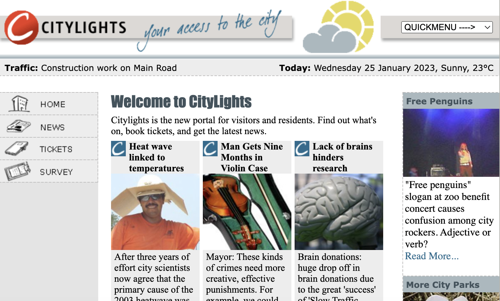
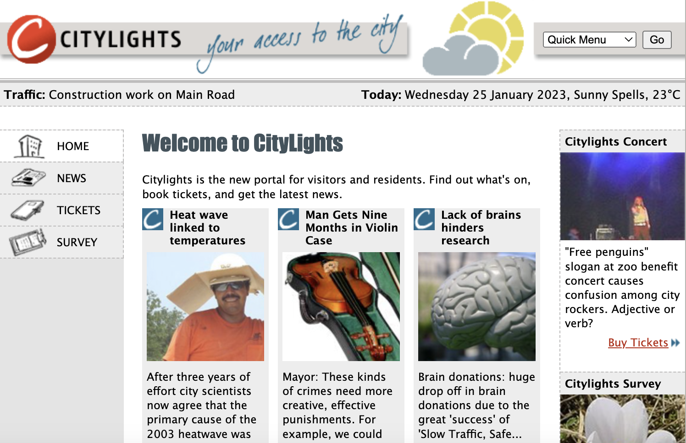

# The What and Why of Accessibility Testing

<!-- OMITTED -->

So far, you've learned how to write tests that help give some increased
confidence whether an application works, and continues to work, as intended. Is
that enough? No.

If you're working on a web application you also need to ensure that it's
accessible to people with either temporary or permanent disability. Why do you
_need_ to do this? For a start, since the Equality Act (2010), **it's the law**
in the UK.

Beyond that, if your organisation provides an important public service there is
a moral obligation to ensure that _everyone_ can use it. This is why
[gov.uk](https://gov.uk) is one of the best examples of accessibility.

If you're yet to be convinced, consider the financial implications of not being
accessible. The points below are quoted from the [Click-Away Pound survey
website](https://www.clickawaypound.com/cap16finalreport.html):

- 71% of disabled customers with access needs will click away from a website
  that they find difficult to use.
- Those customers who click away have an estimated spending power of £11.75
  billion in the UK alone, around 10% of the total UK online spend in 2016.
- 82% of customers with access needs would spend more if websites were more
  accessible.

## Examples

Below you'll find some examples of inaccessible web pages and the users'
impairments which they're likely to impact. Bear in mind that there are many,
many ways, beyond these examples, in which a page might contain accessibility
defects.

### Red / Green Colour Blindness

Here's an example - imagine your company offers a ticket booking service to
theatres where customers can select a seat on a page that includes a graphic
showing the positions of available seats.

The customers are also informed that the different price bands of seats are
shown with colours - purple for the most expensive, then red, then orange, while
green ones are the cheapest due to restricted visibility of the stage. The
graphic is as follows:


If you're not colour blind, that probably seems fine. What if, like 1 in 100 men
or 1 in 300 women, you have deuteranopia (a form of red / green colour
blindness)? To you, that same screen would look more like this.


### Screen Readers

For people with more severe vision impairment, a screen reader, which converts
text on the screen to audio, is an essential tool for navigating websites. Take
a moment to think about how a screen reader might work? How will it parse a web
page and describe its various elements like links, images and headings?

If you came to the conclusion that screen readers must use HTML tags and their
attributes, you're correct! So the interesting thing here is that screen readers
rely on information that is not visible on the page (as do automated tools like
Playwright, as you know very well!) and, as a consequence, are easily missed by
developers, user researchers, product managers, designers and stakeholders.

Consider these two images. The first shows a page with poor accessibility for
screen readers.



This second image shows the same page with those accessibility flaws fixed.



If you are not visually impaired, they look almost identical (and rather dated,
for certain) but the inaccessible version is littered with defects. Let's dig
into one.

All images should have the "alt" attribute, which screen readers use as a
description of what's in the image. At least one image in the inaccessible
version is defective in this way.

**Inaccessible**

```

```

**Accessible**

```

```

[Watch this
video](https://www.youtube.com/watch?v=QP0nbdNU-iE&ab_channel=Communify) (2:39
running time) for a really great demo of the above defect.

Twitter (long before the famous 2022 takeover), also added "alt text" to images
back in 2016 to great fanfare, especially among web accessibility communities.
Until that point, many users who either couldn't display images or who had
visual impairments were missing out on a lot of the content that was available
on Twitter. With the ability for users to add alt text to an image or GIF in
tweets, the content could be unlocked for many more people.

### Hearing Impairments

The two examples above are both about visual impairments. But just because a
user doesn't have a visual impairment, doesn't automatically mean they are able
to access, use and understand the website or application.

For example, embedding all of your important information into an audio
transcript of a video on the front page of your site might be impactful to some
users, but without captions the content could be inaccessible to a set of your
intended users.

While those who are totally deaf or have minor hearing loss could be affected,
there are other impairments such as poor language processing, struggling to
remember what's been heard or difficulty in distinguishing between voices and
background noise.

In this case, providing captions or subtitles (including automatically generated
ones if necessary) or a written transcript of the audio content, then opens that
content up to that set of users.

### Mobility Impairments

While being able to access the content is one set of potential difficulties, the
ability to interact with the website or application could cause problems for a
different set of users.

Those with mobility and motor control impairments might have difficulties
controlling a mouse and/or keyboard. Sites that provide alternative ways to
navigate content, such as allowing users to use a keyboard rather than a mouse
to "Tab" between fields and buttons, are designed to help with those types of
impairments.

As an exercise to see how you could navigate a site without a mouse, browse to
https://www.gov.uk and then, only using the keyboard and *without using the
mouse* try to do the following steps:

* Switch the focus to the Search text field
* Type "car tax" and run the search
* Switch the focus to "Tax your vehicle"

> Note: keys that will particularly help you are Tab, Shift+Tab, Space and
> Enter.

### Thinking and Understanding

People with dyslexia, autism or other learning difficulties might be able to
access and interact with the content, but may have impairments around trying to
understand what it means.

[Take a look at the UK Governments poster's about designing for users with
impairments](https://github.com/UKHomeOffice/posters/blob/master/accessibility/dos-donts/posters_en-UK/accessibility-posters-set.pdf),
particularly those about users on the autism spectrum and users with dyslexia.

## Question

[Here's a UK Government page on
accessibility](https://accessibility.blog.gov.uk/2016/09/02/dos-and-donts-on-designing-for-accessibility/),
which references the same posters you've just been looking at.

On that page, why is there a section called "What the posters say" when you
could just read the content of each poster?

[Next Challenge](02_guidelines.md)

<!-- BEGIN GENERATED SECTION DO NOT EDIT -->

---

**How was this resource?**  
[😫](https://airtable.com/shrUJ3t7KLMqVRFKR?prefill_Repository=makersacademy%2Fextending-testing&prefill_File=phase3%2F01_what_and_why.md&prefill_Sentiment=😫) [😕](https://airtable.com/shrUJ3t7KLMqVRFKR?prefill_Repository=makersacademy%2Fextending-testing&prefill_File=phase3%2F01_what_and_why.md&prefill_Sentiment=😕) [😐](https://airtable.com/shrUJ3t7KLMqVRFKR?prefill_Repository=makersacademy%2Fextending-testing&prefill_File=phase3%2F01_what_and_why.md&prefill_Sentiment=😐) [🙂](https://airtable.com/shrUJ3t7KLMqVRFKR?prefill_Repository=makersacademy%2Fextending-testing&prefill_File=phase3%2F01_what_and_why.md&prefill_Sentiment=🙂) [😀](https://airtable.com/shrUJ3t7KLMqVRFKR?prefill_Repository=makersacademy%2Fextending-testing&prefill_File=phase3%2F01_what_and_why.md&prefill_Sentiment=😀)  
Click an emoji to tell us.

<!-- END GENERATED SECTION DO NOT EDIT -->
